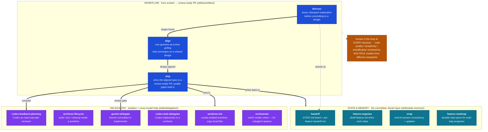
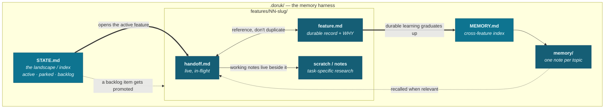

# doruk-ai-harness

**A coding harness for Claude Code, built as a system — not a pile of skills.**
The headline is a from-scratch, human-gated workflow that takes any task `discuss → align → ship`
and gates the result through multiple models from different viewpoints, so what ships is always the
highest-quality version. Three supporting blocks back it: a committed `.doruk/` **state & memory**
layer, cross-model **delegation** in isolated git worktrees, and **understanding** skills that turn
an outcome into something a human can actually absorb.

[Workflow](#1-workflow--the-headline-skillsworkflow) · [State & Memory](#2-state--memory-skillsstate-memory) ·
[Delegation](#3-delegation-skillsdelegation) · [Understanding](#4-understanding-skillsunderstanding) ·
[Install](#install) · [Demo](#see-it-in-motion--demo-app) · [Showcase page](web/index.html)

---

## Why I built this

> *First person, because it's mine and I want to be honest about why it exists, not sell it.*

Two things kept going wrong when I built with an AI agent. First, **"just build it" sessions went
sideways**: either the agent spammed me at every micro-step, or it ran off and produced a large diff
I then had to reverse-engineer and quality-check by hand. Second, **the context window is a terrible
memory**: it evaporates on compaction or a new session, it doesn't travel across machines, and it
rots silently as the model paraphrases its own earlier notes.

So I built a system instead of collecting prompts. The **workflow** is the spine: a task moves from
loose exploration to an agreed design to a shipped PR, with a human in the loop at every real
decision and the quality, complexity, and simplification reviewed by a *genuinely different* model at
each gate. The point is structural: the version that ships is the reviewed one by construction, not
because I remembered to ask for a review afterward.

Underneath that, two supporting blocks do the unglamorous work. **State & memory** puts the memory on
disk: one committed `.doruk/` folder is the durable, indexed source of truth, and the context window
is treated as disposable scratch. **Delegation** lets me hand a unit of work to a *different* model
(OpenAI Codex, Google Gemini) inside an isolated git worktree, review its diff, and merge it or throw
it away with zero risk to the main branch.

---

## The system at a glance

The harness leads with the **workflow** pipeline, backed by two supporting blocks that operate on one
committed `.doruk/` state folder. The diagram below is the canonical view (also in
[`docs/diagram.md`](docs/diagram.md)).



The skills live under four category directories — `skills/workflow/`, `skills/state-memory/`,
`skills/delegation/`, `skills/understanding/` — that exist for browsing. Each leaf is a standard Claude Code skill
(`skills/<block>/<name>/SKILL.md`). For the full description see
[`docs/system-and-flow.md`](docs/system-and-flow.md) (the architecture),
[`docs/memory-system.md`](docs/memory-system.md) (why the memory layer is shaped the way it is), and
[`docs/diagram.md`](docs/diagram.md) (the diagram in isolation). The same content is presented as an
interactive, click-to-drill page in [`web/index.html`](web/index.html).

---

## 1. Workflow — the headline (`skills/workflow/`)

A from-scratch pipeline that takes a task from a vague idea to a review-ready PR, keeps a human in the
loop at **every** decision, and reviews code quality, complexity, and simplification with **multiple
models from different viewpoints** so the version that ships is always the highest-quality one. Three
beats, in order:

| Skill | Beat | What it does |
|---|---|---|
| **`discuss`** | explore | Loose, divergent exploration *before* committing to a design. Riffs across short turns to find the shape of a task, brings opinions and tradeoffs, and deliberately holds off on specs, plans, or code. Hands to `align` only when you say so. |
| **`align`** | converge | A one-question-at-a-time grilling that converges on a shared design. Each question carries a recommended answer; it pins down vague answers instead of moving on, and depth scales from soft (a few questions) to hard (walk every branch). Run before `ship`. |
| **`ship`** | build | Drives the aligned spec to a review-ready PR with minimal check-ins and built-in quality gates. The single planned stop is the review gate; every other stop is conditional. A *different* model reviews the spec and the plan (separately, because they fail differently), and a dedicated simplification pass runs before any code is written. It never merges and never fakes green. |

The non-obvious part is **who reviews**. A single model that writes a plan and then reviews its own
plan just agrees with itself, so the blind spots survive into the code. `ship` routes the spec and
the plan through a genuinely different model, then runs a dedicated simplification pass, so by the
time execution starts, three independent viewpoints — quality, complexity, simplification — have
already shaped the plan.

`ship` is an **orchestrator**: it composes third-party pieces honestly (the *superpowers* collection
for brainstorming / plan-writing / execution, the *ponytail* skill for simplification) plus the
author's own `codex-feedback-planning` for cross-model review. The orchestration and the
always-ship-quality, human-gated pipeline are the contribution here; the composed tools are credited
and are **not** the author's work. If a composed skill isn't installed, `ship` says so and falls back
to a plain built-in equivalent rather than pretending the gate ran. See
[`PROVENANCE.md`](PROVENANCE.md).

---

## 2. State & Memory (`skills/state-memory/`)

The committed `.doruk/` layer: how the harness remembers across sessions, machines, and parallel
agents. The mental model in one line: **treat the context window as RAM and `.doruk/` as the disk**.
One discipline holds it together: **reference, don't duplicate** — each fact has one home, the board
points at the record, the record points at the PR.

| Skill | Role | What it does |
|---|---|---|
| **`handoff`** | orient | Universal `.doruk/` state for any repo. Maintains a `STATE.md` landscape (active / parked / done, plus a backlog) and each feature's live `handoff.md`. Bootstraps `.doruk/` on first use, so a repo needs no manual setup. |
| **`feature-roadmap`** | plan | Durable step-spine for multi-step programs. When a feature has ordered phases that span sessions (craft→test→refine, a migration, an audit sweep), adds a `roadmap.md` beside `handoff.md` so the map never gets clobbered by Markov rewrites. `handoff.md` shrinks to a two-line pin; `roadmap.md` holds the full step list, a mermaid flow, and a checkable "Done when" per step. |
| **`feature-organize`** | distill | Post-ship distillation. Turns a feature folder's in-flight scratch into a durable `feature.md` record (decisions + WHY) and triages aux files: keep / archive / delete. Full mode rewrites on close; narrow mode appends one note when a sub-deliverable ships. |
| **`wrap`** | multi-agent | End-of-session wrap-up for multi-agent feature folders where each agent owns one folder. Runs 5 consistency checks (state agreement, stale links, cross-folder writes, handoff trim, date convention) then the mechanical updates. Composes with `handoff`. |

The substrate all three operate on:

```
.doruk/
├── STATE.md                # the landscape: what's in motion, what's parked  (read first)
├── MEMORY.md               # durable, cross-feature learnings (the index)
├── memory/                 # one note per topic
└── features/
    └── NN-slug/            # one folder per feature
        ├── feature.md      # durable record: orientation block + decisions + WHY
        ├── handoff.md      # live, in-flight handoff
        ├── roadmap.md      # durable step-spine (multi-step programs only)
        ├── step-0N-*/      # one folder per step, with artifacts (multi-step only)
        └── archive/        # scratch that was only true during the work (optional)
```

Committed to git on purpose — so state travels across devices (`git pull` and the memory is here),
history is a deletion backstop (trim ruthlessly; every prior version survives), and the record is
auditable. In team repos the folder is gitignored as a private workspace instead.

### How the pieces navigate

The files aren't a flat folder — they're a graph. `STATE.md` is the index you read first; it points
at the active feature; the feature's live `handoff.md` and its durable `feature.md` reference each
other; learnings that outlive a feature graduate up into the `MEMORY.md` index and get recalled later.
The discipline is **reference, don't duplicate**: each fact has exactly one home, and everything else
links to it.



**Who moves what** — the three state skills are the movers between these files:

| Navigation | Driven by |
|---|---|
| Read `STATE.md` → open the active feature's `handoff.md` → recall relevant `memory/` notes | **`handoff`** (+ recall) |
| Promote a backlog item in `STATE.md` into a new `features/NN-slug/` folder | **`handoff`** |
| When a feature becomes a multi-step program: add `roadmap.md` + `step-0N-*/` folders; shrink `handoff.md` to a pin | **`feature-roadmap`** |
| On ship: distill the live `handoff.md` into the durable `feature.md`, graduate learnings into `MEMORY.md` | **`feature-organize`** |
| End of session: check the files still agree, trim the board, fix stale links | **`wrap`** |

A new session never re-reads chat logs: it orients on `STATE.md`, walks into the one feature that's
moving, and the memory is already there.

---

## 3. Delegation (`skills/delegation/`)

Hand a unit of work to a **different model** — OpenAI Codex or Google Gemini — without giving up
control or safety, and isolate any branch work in its own git worktree. The git worktree is the
isolation primitive: the delegate works sandboxed in its own checkout, and the driving agent reviews
the diff before any of it reaches the main branch.

> **Honest scope.** The Codex and Gemini skills **orchestrate external CLIs I did not build** — I
> drive the OpenAI Codex CLI and the Google Gemini CLI as subprocesses. The skills are mine; the CLIs
> and the models behind them are not. See [`PROVENANCE.md`](PROVENANCE.md).

| Skill | Role | What it does |
|---|---|---|
| **`codex-feedback-planning`** | consult | Orchestrates the OpenAI Codex CLI as a **read-only** plan reviewer. A different model reads your plan against the real codebase and tells you what it would break. Makes no changes. |
| **`codex-task-delegator`** | implement | Orchestrates the OpenAI Codex CLI as an **implementer** in an isolated worktree. Claude briefs it, Codex executes, Claude reviews the diff and merges or discards. |
| **`gemini-delegate`** | both | Orchestrates the Google Gemini CLI in either role — read-only consultant or sandboxed worktree implementer. Same shape as the Codex skills, a different model. |
| **`orchestrate`** | reference | Which-agent-when lookup table for a build where every unit of work is delegated to a model-tiered subagent: Fable once up front for the hardest design/plan, Sonnet as the default for all labor, Opus for the tricky logic, Codex for a one-shot review at the end. |
| **`worktree-init`** | isolate | Creates an isolated git worktree for a branch, copies the untracked local files git won't carry (`.env`, IDE rules, agent config), and bootstraps the environment so the worktree runs immediately. |
| **`worktree-lifecycle`** | context | Auto-loaded operating manual for an agent running *inside* a worktree: orient, build/test with isolated host resources (own ports, own container-stack name), and clean up without losing uncommitted work. |

Two practical invariants the delegation skills encode, learned the hard way driving these CLIs
non-interactively: **sandbox the writes** (run the delegate in workspace-write / yolo mode inside the
worktree so the worktree boundary contains the blast radius) and **close stdin** (redirect
`< /dev/null` on the CLI invocation, or it hangs at 0% CPU waiting for end-of-input — the single most
common failure mode in scripted delegation).

---

## 4. Understanding (`skills/understanding/`)

Skills whose job is to make an *outcome* legible, not to produce one — turning a diff, a plan, or an
answer into something a human can actually absorb. In the same spirit as the built-in `simple` /
`tldr` re-explain knobs, but heavier-weight: instead of compressing text, this category renders a
standalone, explorable artifact.

> **Honest scope.** `explain-diff-html` is external — credit to Geoffrey Litt. See [`PROVENANCE.md`](PROVENANCE.md).

| Skill | Role | What it does |
|---|---|---|
| **`explain-diff-html`** | explain | Turns a code change, diff, branch, or PR into a self-contained HTML page: background, core intuition with toy examples, a walkthrough of the code, and a five-question interactive quiz to check understanding. |

---

## See it in motion — demo app

[`demo-app/`](demo-app/) is a worked example: a **fictional, throwaway** todo-API project that exists
only to show a real, populated `.doruk/` mid-flight. Two features are live:

- **feature 01 · tag-filtering** — a plain-handoff feature (one `handoff.md` + `feature.md`). Read
  [`STATE.md`](demo-app/.doruk/STATE.md) first, then the live
  [`handoff.md`](demo-app/.doruk/features/01-tag-filtering/handoff.md) and the durable
  [`feature.md`](demo-app/.doruk/features/01-tag-filtering/feature.md).
- **feature 03 · csv-export** — a `/feature-roadmap` example: a 4-step program with a mermaid spine,
  step folders, and a pinned `handoff.md`. Read [`roadmap.md`](demo-app/.doruk/features/03-csv-export/roadmap.md)
  for the map, then [`handoff.md`](demo-app/.doruk/features/03-csv-export/handoff.md) for the pin.

A session ends; the next one rebuilds the full mental model in under a minute, with no archaeology
through chat logs.

---

## Install

Three ways to install, fastest first. All of them put every skill where Claude Code can discover it.

### Option 1 — install script (recommended, guaranteed)

`install.sh` copies **every leaf skill** (each `skills/<block>/<name>/`) into `~/.claude/skills/`,
**flattening** the category directories — the `workflow/`, `state-memory/`, `delegation/` folders
exist for browsing, but Claude Code discovers skills by name, so the installed layout is flat. It's
**idempotent** — safe to re-run; it overwrites the harness's own skills and never touches anything
else in that folder.

```bash
git clone https://github.com/doruktarhan/doruk-ai-harness.git
cd doruk-ai-harness
./install.sh           # copy all leaf skills into ~/.claude/skills/ (flattened)
./install.sh --dry-run # show what it would do, change nothing
./install.sh --help    # usage
```

Restart Claude Code (or start a new session) to pick up the newly installed skills.

### Option 2 — Claude Code plugin (via `/plugin`)

The harness also ships as a Claude Code **plugin**, served from its own single-plugin
**marketplace**. From inside Claude Code:

```
/plugin marketplace add doruktarhan/doruk-ai-harness
/plugin install doruk-ai-harness@doruk-ai-harness
```

- The first command registers this repo as a marketplace (it contains
  [`.claude-plugin/marketplace.json`](.claude-plugin/marketplace.json)).
- The second installs the `doruk-ai-harness` plugin
  ([`.claude-plugin/plugin.json`](.claude-plugin/plugin.json)).

> **All 14 skills load natively.** The skills live under category subdirectories
> (`skills/<block>/<name>/`), and each leaf is declared explicitly in the plugin's
> [`skills[]` manifest](.claude-plugin/plugin.json). Claude Code reads that manifest, so the plugin
> route picks up every skill without flattening — no reliance on subdirectory recursion. `install.sh`
> (Option 1) remains an offline / non-Claude-Code fallback that flattens every leaf into
> `~/.claude/skills/` directly.

### Option 3 — manual copy

If you'd rather not run the script, copy the leaf skill folders yourself, flattening the category
dirs:

```bash
mkdir -p ~/.claude/skills
cp -R skills/*/*/ ~/.claude/skills/
```

Each `skills/<block>/<name>/SKILL.md` is a standard Claude Code skill with YAML frontmatter; dropping
the leaf folder into `~/.claude/skills/` is all that's required.

> **Configure once.** A few skills leave project-specific placeholders — base branch, test/lint
> commands, path conventions — marked inline as `<...>`. Fill them on first use, or wire them into a
> thin project wrapper skill that calls these.
>
> **External CLIs (delegation + ship's review gate).** The Codex and Gemini skills require their CLIs
> to be installed separately and authenticated: `npm i -g @openai/codex && codex auth` ·
> `npm i -g @google/gemini-cli`. The skills check for these and tell you if they're missing.
>
> **Composed skills (`ship`).** For `ship`'s full quality gates, also install the third-party
> *superpowers* collection and *ponytail* skill. Without them `ship` still runs; it falls back to
> reviewing manually where a gate would have run.

---

## Repo layout

```
doruk-ai-harness/
├── README.md                     # you are here
├── install.sh                    # idempotent installer → flattens leaf skills into ~/.claude/skills/
├── LICENSE                       # MIT
├── PROVENANCE.md                 # honest attribution
├── .claude-plugin/
│   ├── plugin.json               # the doruk-ai-harness plugin (bundles all skills)
│   └── marketplace.json          # single-plugin marketplace for /plugin
├── skills/
│   ├── workflow/                 # discuss · align · ship  (the headline)
│   ├── state-memory/             # handoff · feature-roadmap · feature-organize · wrap
│   ├── delegation/               # codex-feedback-planning · codex-task-delegator · gemini-delegate · orchestrate · worktree-init · worktree-lifecycle
│   └── understanding/                   # explain-diff-html (third-party, imported verbatim — see PROVENANCE.md)
├── docs/                         # system-and-flow, memory-system, diagram
├── demo-app/                     # worked example: a real .doruk/ mid-flight
└── web/index.html                # interactive showcase (GitHub Pages)
```

---

## License & attribution

MIT — see [`LICENSE`](LICENSE). These are my own skills, built for Claude Code, except
`skills/understanding/explain-diff-html` ([external, credit Geoffrey Litt](https://gist.github.com/geoffreylitt/a29df1b5f9865506e8952488eac3d524)).
The delegation skills orchestrate external CLIs I did not build (OpenAI Codex, Google Gemini), and
`ship` composes third-party skills (*superpowers*, *ponytail*) it does not own. Full honesty on
what's mine and what isn't: [`PROVENANCE.md`](PROVENANCE.md).
