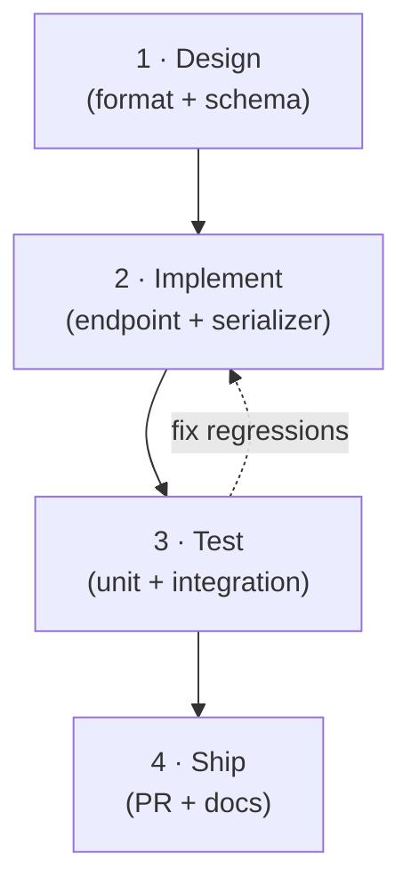

# 03-csv-export — roadmap (the durable spine)
> This is the MAP, not the live state. It does not change as we progress.
> Current position lives in `handoff.md`. Each step's detail + artifacts live in its `step-0N-*/` folder.

## The 4 steps

### Step 01 · Design — `step-01-design/`
Decide the CSV shape: which fields to include, column order, header names, and how to handle
optional fields (empty cell vs omit). Also decide the URL pattern (`GET /todos/export.csv` vs
a `?format=csv` param) and whether streaming is needed at expected row counts.
**Done when:** a one-page spec in `step-01-design/spec.md` exists covering columns, URL,
and the empty-field policy; Doruk has read and approved it.

### Step 02 · Implement — `step-02-implement/`
Add the export endpoint to `src/app.py`. Serialize the current in-memory `_TODOS` list using
Python's `csv.writer`. No new dependencies — stdlib only. Hook the route into the existing
Flask app exactly like `/todos` but returning `text/csv` with a `Content-Disposition` header.
**Done when:** `GET /todos/export.csv` returns a valid CSV file in a browser; the columns
match the spec from Step 01; no existing tests break.

### Step 03 · Test — `step-03-test/`
Add tests to `src/test_app.py`: (a) empty store returns a header row only; (b) one item
returns header + one data row; (c) `Content-Type` is `text/csv`; (d) `Content-Disposition`
contains `attachment`. Run with `pytest`.
**Done when:** all four test cases pass and `pytest` exits 0 with no warnings.

### Step 04 · Ship — `step-04-ship/`
Open a PR, get it reviewed, merge. Update `demo-app/README.md` to mention the export
endpoint. Add a one-line note in `STATE.md` when done.
**Done when:** PR merged to main; `demo-app/README.md` reflects the new route.

## Out of scope (parked)
- **Streaming large exports** — the in-memory store is tiny; chunked response is a future
  concern if the store moves to SQLite. Parked.
- **Filtering on export** — `?tags=foo` on the export endpoint. Depends on feature 01
  (tag-filtering) being stable. Parked until 01 ships.
- **Auth on the export route** — no auth anywhere in the demo; same deliberate omission as
  the rest of the API. Noted, not in scope.
