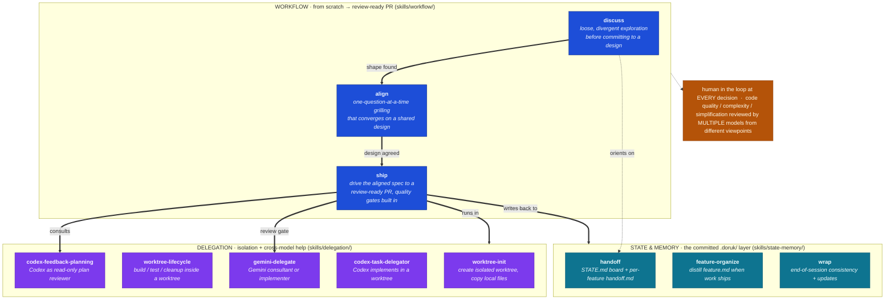

# Harness at a glance

The headline is the **workflow**: a from-scratch pipeline that takes a task `discuss → align → ship`,
keeps a human in the loop at every decision, and gates the result through multiple models so what
ships is the highest-quality version. Two supporting blocks — **state &amp; memory** and **delegation** —
power that pipeline. Read [`system-and-flow.md`](./system-and-flow.md) for the full description.

**Caption.** The **workflow** block is the pipeline that turns a task into shipped code from scratch.
`discuss` is loose, divergent exploration to find the shape of a task before committing to any design.
`align` is a one-question-at-a-time grilling that converges on a shared design, run before ship. `ship`
drives that aligned spec to a review-ready PR with minimal check-ins. A human stays in the loop at every
decision, and code quality, complexity, and simplification are reviewed by multiple models from different
viewpoints, so what ships is always the highest-quality version.

Two blocks support the pipeline. **State &amp; memory** is the committed `.doruk/` layer: `handoff` keeps the
`STATE.md` board and per-feature handoffs, `feature-organize` distills `feature.md` once work ships, and
`wrap` runs the end-of-session consistency checks and updates. **Delegation** provides isolation and
cross-model help: `worktree-init` and `worktree-lifecycle` create and run isolated git worktrees, while
`codex-feedback-planning`, `codex-task-delegator`, and `gemini-delegate` bring Codex and Gemini in as
reviewers or implementers. `discuss` orients on the state layer, and `ship` runs in worktrees, consults
the delegates as quality gates, and writes results back to `.doruk/`.
