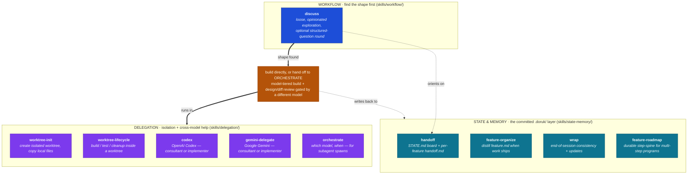

# Harness at a glance

The headline is the **workflow**: `discuss` finds the shape of a task, then you build it directly
or hand a multi-step build to `orchestrate`, which keeps a human in the loop and gates the result
through multiple models so what lands is the highest-quality version. Two supporting blocks —
**state &amp; memory** and **delegation** — power that pipeline. Read
[`system-and-flow.md`](./system-and-flow.md) for the full description; `skills/legacy/` keeps the
superseded `discuss → align → ship` pipeline for reference (see its `README.md`).

```mermaid
flowchart TB
    subgraph WF["WORKFLOW · find the shape first (skills/workflow/)"]
        D["<b>discuss</b><br/><i>loose, opinionated exploration,<br/>optional structured-question round</i>"]
    end

    BUILD["build directly, or hand off to ORCHESTRATE<br/>model-tiered build + design/diff review gated by a different model"]
    D ==>|"shape found"| BUILD

    subgraph SM["STATE &amp; MEMORY · the committed .doruk/ layer (skills/state-memory/)"]
        direction TB
        SM1["<b>handoff</b><br/><i>STATE.md board + per-feature handoff.md</i>"]
        SM2["<b>feature-organize</b><br/><i>distill feature.md when work ships</i>"]
        SM3["<b>wrap</b><br/><i>end-of-session consistency + updates</i>"]
        SM4["<b>feature-roadmap</b><br/><i>durable step-spine for multi-step programs</i>"]
    end

    subgraph DG["DELEGATION · isolation + cross-model help (skills/delegation/)"]
        direction TB
        DG1["<b>worktree-init</b><br/><i>create isolated worktree, copy local files</i>"]
        DG2["<b>worktree-lifecycle</b><br/><i>build / test / cleanup inside a worktree</i>"]
        DG3["<b>codex</b><br/><i>OpenAI Codex — consultant or implementer</i>"]
        DG4["<b>gemini-delegate</b><br/><i>Google Gemini — consultant or implementer</i>"]
        DG5["<b>orchestrate</b><br/><i>which model, when — for subagent spawns</i>"]
    end

    D -.->|orients on| SM1
    BUILD ==>|runs in| DG
    BUILD -.->|writes back to| SM

    classDef wf fill:#1d4ed8,stroke:#1e3a8a,color:#eff6ff;
    classDef hitl fill:#b45309,stroke:#92400e,color:#fffbeb;
    classDef sm fill:#0e7490,stroke:#155e75,color:#f0fdff;
    classDef dg fill:#7c3aed,stroke:#5b21b6,color:#faf5ff;
    class D wf;
    class BUILD hitl;
    class SM1,SM2,SM3,SM4 sm;
    class DG1,DG2,DG3,DG4,DG5 dg;
```

**Caption.** The **workflow** block is now one skill: `discuss` is loose, opinionated exploration to
find the shape of a task, with an optional structured-question round once things converge. From there
you build directly, or hand a multi-step build to `orchestrate`, which model-tiers the subagents and
gates the design and the final diff with a genuinely different model before anything lands. A human
stays in the loop at every decision that matters.

Two blocks support the pipeline. **State &amp; memory** is the committed `.doruk/` layer: `handoff` keeps
the `STATE.md` board and per-feature handoffs, `feature-roadmap` adds a step-spine for multi-step
programs, `feature-organize` distills `feature.md` once work ships, and `wrap` runs the end-of-session
consistency checks and updates. **Delegation** provides isolation and cross-model help: `worktree-init`
and `worktree-lifecycle` create and run isolated git worktrees, `codex` and `gemini-delegate` bring
Codex and Gemini in as reviewers or implementers, and `orchestrate` is the model-tiering reference for
a delegated build. `discuss` orients on the state layer; a delegated build runs in worktrees, consults
`codex`/`gemini-delegate` as quality gates, and writes results back to `.doruk/`.
