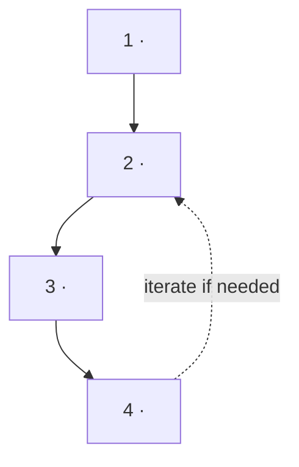

# Feature-roadmap — a durable step-spine for multi-step features

Plain `/handoff` carries one feature's live state in `handoff.md` (a `## Tasks` board + Doing/Next).
That cramps when a feature is a **multi-step program**: the steps are an ordered plan that *doesn't*
change as you progress, but `handoff.md` is Markov (rewritten to current truth each session), so the
plan keeps getting overwritten or bloats the handoff. **Split them:** the durable plan moves to
`roadmap.md`; `handoff.md` shrinks to a pin — "we're at step N" plus that step's live state.

> The file is named `roadmap.md`, **not** `workflow.md`, on purpose — "workflow" collides with
> Claude's Workflow orchestration tool. Keep the name to avoid confusing agents.

## When to use (vs plain handoff)

- **Plain `/handoff`** — single feature, one or a few tasks. The `## Tasks` board is enough.
- **`/feature-roadmap`** — the feature is a *program*: ordered steps, spans sessions, iterates, and
  steps produce artifacts. Examples: craft→test→refine a skill, a migration, an audit sweep, going
  through many applications/items. Reach for this the moment a discussion converges on "step 1…N".

If unsure, start with plain handoff; promote to a roadmap when the Tasks board can't hold the plan.

## Before you author: are the steps actually settled?

A roadmap is only as good as the steps in it. **If this skill triggers but the ordered steps — and
each step's goal — are not yet clear, do NOT write `roadmap.md` yet.** Authoring a spine from a vague
idea just hides the vagueness behind official-looking structure; the next agent inherits fake
certainty.

First converge on the steps:

- **REQUIRED FIRST:** if the shape is still open, run a discussion → alignment pass (the `discuss`
  then `align` skills, or any equivalent back-and-forth) until you have **(a)** an ordered step list
  and **(b)** an observable goal ("Done when") for each step. Only then author the roadmap.
- The roadmap captures a *decided* plan. If you find yourself inventing steps while writing it, stop —
  that's the signal the plan isn't settled. Go back to discussion.

You know the steps are settled when you can state each one's "Done when" as something an agent could
check, not a vibe. That checkable goal per step is mandatory — it's what makes the roadmap usable.

## Layout

```
features/NN-slug/
  feature.md        # WHY + orientation; its > Key files points at roadmap.md
  roadmap.md        # the durable step-spine: mermaid + ordered step blocks (THIS skill)
  handoff.md        # Markov "you-are-here": > Roadmap position: at step N + that step's live state
  step-01-<slug>/   # one folder per step that produces artifacts (README + that step's outputs)
  step-02-<slug>/   # ...
```

Three tiers, no overlap: **roadmap.md** = the map (durable, doesn't change as you progress) ·
**handoff.md** = the pin (which step + live state) · **feature.md** = why it exists (distilled on
ship by `/feature-organize`). Never duplicate the step list into handoff.md — point at the roadmap.

## roadmap.md template

````
# <NN-slug> — roadmap (the durable spine)
> This is the MAP, not the live state. It does not change as we progress.
> Current position lives in handoff.md. Each step's detail + artifacts live in its step-0N-*/ folder.



## The N steps

### Step 01 · <name> — `step-01-<slug>/`
<what this step does, 2-4 lines>
**Done when:** <observable, checkable condition>

### Step 02 · <name> — `step-02-<slug>/`
...

## Out of scope (parked)
<adjacent concerns deliberately NOT in this program — keep them from dragging on the work>
````

**The step block is the unit.** Each step = a name + a folder pointer + a few lines of intent + a
**Done when** that's observable (an agent can check it, not "feels done"). The mermaid at the top is
the visual; render it in any markdown preview. Use mermaid, not a standalone HTML diagram — a 5-step
flow doesn't justify a separate artifact that drifts from the steps. Upgrade to HTML only if the flow
branches heavily.

## handoff.md changes (when a feature has a roadmap)

- Add to the orientation block: `> Roadmap position: **at Step N (<status>).** Spine → roadmap.md`.
- `## Doing` / `## Next` carry only the *current step's* live state — not the whole plan.
- Drop the `## Tasks` board; the roadmap's step blocks replace it.

## Step folders

Give a step a folder when it produces artifacts you'll look back at (drafts, captured data, reports).
Uniform `step-0N-*/` folders for *every* step are also fine — costs little and makes "where is X" a
non-question for agents. Each folder gets a one-line `README.md`: its purpose + the **Done when**.
Decision-only steps with no artifacts can skip a folder, or keep an empty one with just the README.

## Rules

- **Roadmap is durable; handoff is Markov.** Edit the roadmap only when the *plan* changes (a step
  splits, reorders, gets cut) — not on progress. Progress is a handoff edit.
- **One source of truth for the step list** — the roadmap. handoff points at it; STATE's row
  summarizes it. No third copy.
- **Mermaid lives in the same file as the steps** so it can't drift from them.
- **Re-read roadmap.md + handoff.md before editing** — another agent or device may have moved the pin.
- Bump `> Updated:` on handoff. If `.doruk/` is committed, commit and push after.

## Composes with

- **handoff** — `/handoff` still runs each session; with a roadmap, it updates the pin (step N + live
  state) instead of carrying the plan. **REQUIRED BACKGROUND:** the handoff skill owns STATE.md + the
  feature folder conventions this builds on.
- **feature-organize** — on ship, `/feature-organize` distills the run into `feature.md`: the roadmap's
  decisions and what each step learned graduate into the durable record; the roadmap itself can stay as
  the historical spine or be summarized. Triage step folders like any other scratch (keep/archive/delete).

## Bootstrap on an existing feature

If a plain-handoff feature outgrows its Tasks board: create `roadmap.md` from the template, move the
step list out of `handoff.md` into it, add the `> Roadmap position:` line to handoff, create the
`step-0N-*/` folders, and point `feature.md`'s `> Key files:` at the roadmap. Update the STATE row to
name it a multi-step program.
